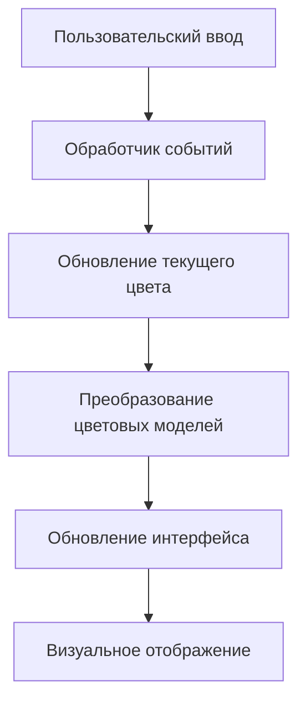

# Лабораторная работа №1 `Вариант 4`
[](README.md)
[](https://developer.mozilla.org/ru/docs/Web/HTML)
[](https://developer.mozilla.org/ru/docs/Web/CSS)
[](https://developer.mozilla.org/ru/docs/Web/JavaScript)

Интерактивное веб-приложение для исследования и преобразования цветов между различными цветовыми моделями.

## Особенности

- **Три цветовые модели**: RGB, HSV и LAB
- **Интерактивный цветовой пикер** с визуальным выбором
- **Слайдер оттенка** для точной настройки цвета
- **Синхронизация в реальном времени** между всеми моделями
- **HEX-ввод** для быстрого задания цвета
- **Адаптивный дизайн** для мобильных устройств
- **Визуальное отображение** текущего цвета

## Быстрый старт

### Онлайн доступ
Откройте https://puru5her.github.io/PKG_Lab_1/ в вашем браузере.

### Локальная установка
1. Скачайте или клонируйте репозиторий:
```bash
git clone https://github.com/PuRu5heR/PKG_Lab_1.git
```

2. Откройте файл `index.html` в вашем браузере:
```bash
cd PKG_Lab_1
open index.html
```

Или используйте Live Server в VS Code:
```bash
code .
# Нажмите Ctrl+Shift+P → "Live Server: Open with Live Server"
```

## Как использовать

### Основные элементы управления

1. **Цветовой дисплей** - показывает текущий выбранный цвет
2. **HEX ввод** - введите цвет в формате `#RRGGBB`
3. **Цветовой пикер** - кликните для выбора насыщенности и яркости
4. **Слайдер оттенка** - регулируйте основной оттенок цвета
5. **Панель инструментов** - случайный цвет и сброс

### Цветовые модели

#### 🟥 RGB (Red, Green, Blue)
- **R**: Красный (0-255)
- **G**: Зеленый (0-255)
- **B**: Синий (0-255)

#### 🟨 HSV (Hue, Saturation, Value)
- **H**: Оттенок (0°-360°)
- **S**: Насыщенность (0%-100%)
- **V**: Яркость (0%-100%)

#### 🟦 LAB (Lightness, A, B)
- **L**: Светлота (0-100)
- **A**: Зелено-красная ось (-128 - +127)
- **B**: Сине-желтая ось (-128 - +127)

## Технические детали

### Технологии
- **HTML5** - структура приложения
- **CSS3** - стилизация и адаптивный дизайн
- **Vanilla JavaScript** - логика и взаимодействие
- **Canvas API** - отрисовка цветовых палитр

### Архитектура


### Алгоритмы преобразования

#### RGB → HSV
```javascript
function rgbToHsv(r, g, b) {
    const max = Math.max(r, g, b);
    const min = Math.min(r, g, b);
    const delta = max - min;
    
    let h = 0;
    if (delta !== 0) {
        // Вычисление оттенка на основе максимального компонента
    }
    const s = max === 0 ? 0 : delta / max;
    const v = max;
    
    return { h, s, v };
}
```

#### RGB → LAB (через XYZ)
```javascript
function rgbToLab(r, g, b) {
    // Гамма-коррекция
    // Преобразование в XYZ
    // Нормализация по D65
    // Преобразование в LAB
    return { l, a, b };
}
```

## Совместимость

| Браузер | Версия | Статус |
|---------|--------|--------|
| Chrome | 60+ | ✅ Полная поддержка |
| Firefox | 55+ | ✅ Полная поддержка |
| Safari | 12+ | ✅ Полная поддержка |
| Edge | 79+ | ✅ Полная поддержка |

## Цветовые модели

### RGB (Аддитивная модель)
Используется в мониторах и дисплеях. Цвет формируется смешением красного, зеленого и синего света.

### HSV (Воспринимаемая модель)
Более интуитивна для человека. Отделяет оттенок от насыщенности и яркости.

### LAB (Перцептивно-равномерная модель)
Разработана для равномерного восприятия цветовых различий человеческим глазом.

## Взаимодействие

Все элементы управления синхронизированы:
- Изменение в RGB обновляет HSV и LAB
- Изменение в HSV обновляет RGB и LAB
- Изменение в LAB обновляет RGB и HSV
- Выбор в пикерере обновляет все модели
- HEX ввод применяется ко всем моделям

## Известные ограничения

1. **LAB преобразования** могут иметь небольшие погрешности из-за округления
2. **Цветовой охват** ограничен sRGB пространством
3. **Производительность** на мобильных устройствах может быть ниже при активном использовании

## Контакты

- **Автор**: Сайлаубаев Амир Русланович
- **Telegram**: [https://t.me/amirsajl](https://t.me/amirsajl)
- **GitHub**: [https://github.com/PuRu5heR](https://github.com/PuRu5heR)